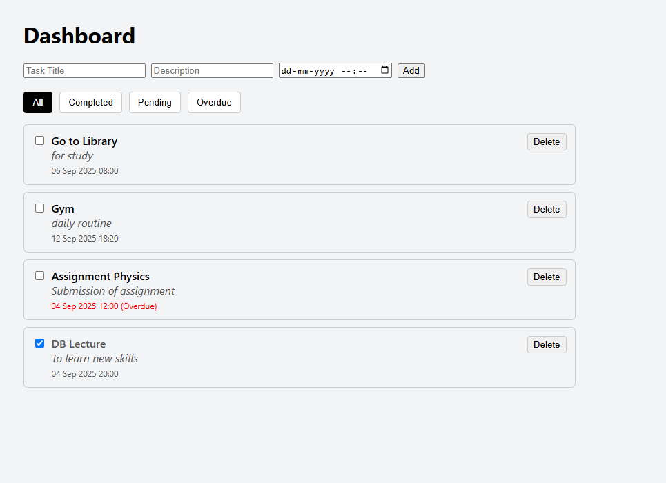

# Task Management App

A simple task management application with **FastAPI backend** and **React frontend**.

---

## Features
- User registration & login (JWT authentication)
- Add, edit, delete tasks
- Mark tasks as completed
- Filter tasks: all, completed, pending, overdue

---

## Project Structure

backend/
├── auth.py
├── crud.py
├── database.py
├── main.py
├── models.py
├── schemas.py
└── tasks.db (optional)
frontend/
├── public/
│ └── index.html
├── src/
│ ├── components/
│ ├── context/
│ ├── pages/
│ └── services/
├── App.js
├── App.css
├── index.js
├── index.css
└── package.json

screenshots/
└── dashboard.png
└── login.png


---

## Setup Instructions

### Backend
1. Create a virtual environment:
   ```bash
   python -m venv venv
   source venv/bin/activate    # Linux/Mac
   venv\Scripts\activate       # Windows

Install Dependencies
pip install fastapi uvicorn sqlalchemy pydantic python-jose passlib

Run backend
uvicorn main:app --reload

Run Frontend
npm install
npm start

User registration


User login


User Dashboard
